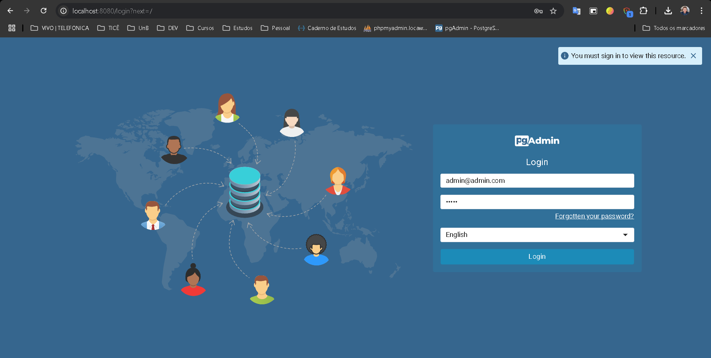
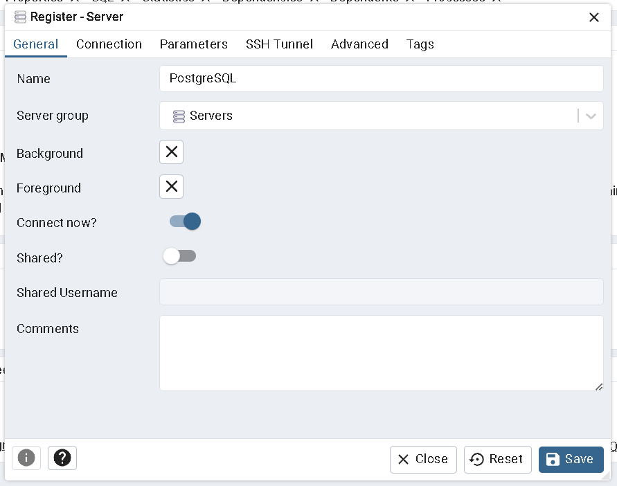
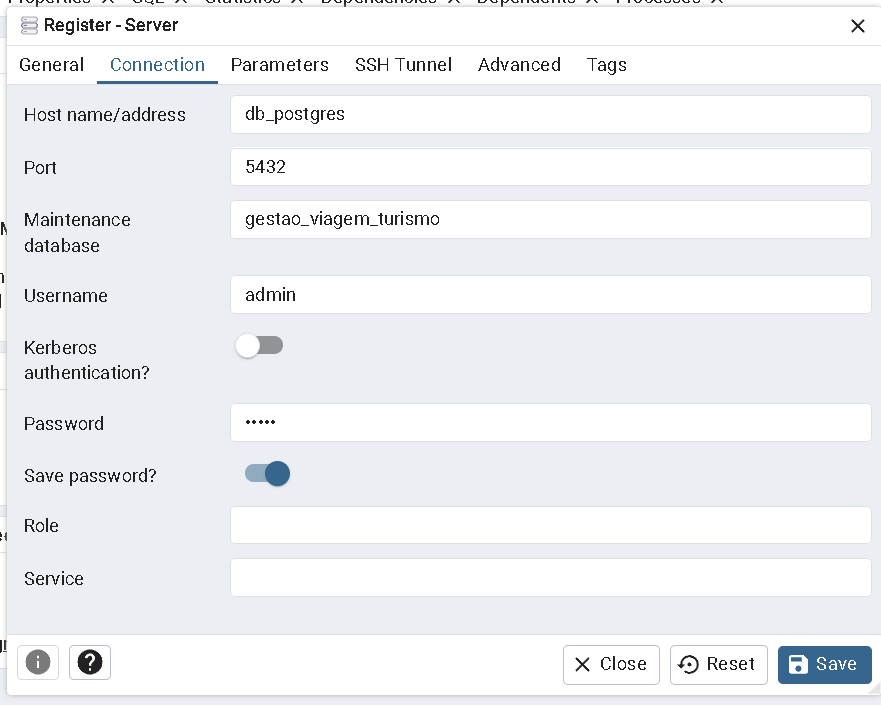

# Instruções para Rodar o Banco de Dados PostgreSQL

O banco de dados foi configurado com um arquivo `docker-compose.yml` e scripts de inicialização SQL.

## Pré-requisitos

Antes de começar, verifique se você tem os seguintes requisitos:

- [Docker Desktop](https://www.docker.com/get-started) instalado em sua máquina.
- Ou [Docker Compose](https://docs.docker.com/compose/install/) ser for Linux.

## Passos para rodar o banco de dados

### 1. Clonar o repositório

Primeiramente, faça o clone do repositório para sua máquina local, caso ainda não tenha feito:

```bash
git clone https://https://github.com/kelvennds1/trabalho_bd.git
cd trabalho_bd
```

### 2. Subir o serviço do Docker

No diretório onde o arquivo `docker-compose.yml` está localizado, execute o seguinte comando para iniciar o contêiner do PostgreSQL:

```bash
cd database
docker-compose up --build
```

Este comando irá baixar a imagem do PostgreSQL (se necessário), criar o contêiner e iniciar o banco de dados.

### 3. Acessar o banco de dados

Após o contêiner estar em funcionamento, você pode acessar o banco de dados utilizando qualquer cliente PostgreSQL (como [pgAdmin](https://www.pgadmin.org/) ou a linha de comando).

**Configurações de acesso:**

- **Host:** `localhost`
- **Porta:** `5432`
- **Usuário:** `admin`
- **Senha:** `admin`
- **Banco de dados:** `gestao_viagem_turismo`

Se preferir usar a linha de comando, você pode executar o seguinte comando dentro do contêiner do PostgreSQL:

```bash
docker exec -it postgres psql -U admin -d gestao_viagem_turismo
```

#### 3.1. **Como acessar o banco pelo pgAdmin**

Ao rodar o docker, o pgAdmin estará acessível através da URL:

```
http://localhost:8080
```

- **E-mail:** `admin@admin.com`
- **Senha:** `admin`

Essas credenciais são usadas para fazer login na interface do pgAdmin.



### 3. **Configuração do banco de dados no pgAdmin**

Após fazer o login no pgAdmin, siga estas etapas para conectar ao seu banco de dados PostgreSQL:

1. **Adicionar um servidor**:

   - No painel ao centro, clique com no botão direito em "Add New Server" e escolha **Create > Server**.
   - Na janela de criação de servidor, insira as seguintes informações:
     - **Name**: Escolha um nome para o servidor (por exemplo, `PostgreSQL`).
     - **Connection**:
       - **Host name/address**: `db_postgres` (nome do serviço do PostgreSQL no Docker).
       - **Port**: `5432
       - **Maintenance database**: `gestao_viagem_turismo`
       - **Username**: `admin`
       - **Password**: `admin`

2. **Salvar a conexão**: Após preencher as informações, clique em **Save**.


 

### 4. **Gerenciando o Banco de Dados no pgAdmin**

Depois de salvar a conexão, o banco de dados `gestao_viagem_turismo` aparecerá no painel à esquerda. Agora você pode fazer o seguinte:

- **Explorar as tabelas e dados**: Clique no nome do banco de dados, depois em "Schemas" > "public" > "Tables" para visualizar as tabelas.
- **Executar consultas SQL**: No menu "Tools", clique em "Query Tool" para executar comandos SQL diretamente no banco de dados.
- **Criar novas tabelas**: Use a interface do pgAdmin para criar novas tabelas, inserir dados e realizar outras operações.

### 6. Parar o serviço

Para parar o contêiner e liberar os recursos, execute CTRL + C no termimal ou:

```bash
docker-compose down
```

Isso irá parar o contêiner e remover os recursos criados, mas os dados serão persistidos no volume Docker.

## Dicas

- Os scripts SQL no diretório `/docker-entrypoint-initdb.d` são executados **somente** quando o banco de dados é criado pela primeira vez. Se você quiser reexecutá-los, pode remover o volume persistente ou recriar o contêiner.

**Nota:** Certifique-se de que o Docker esteja rodando corretamente antes de executar os comandos.
